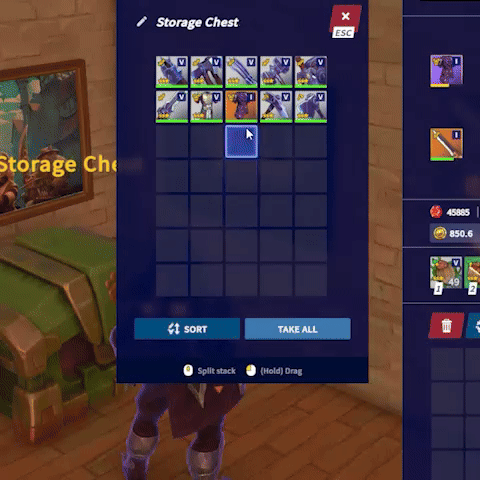
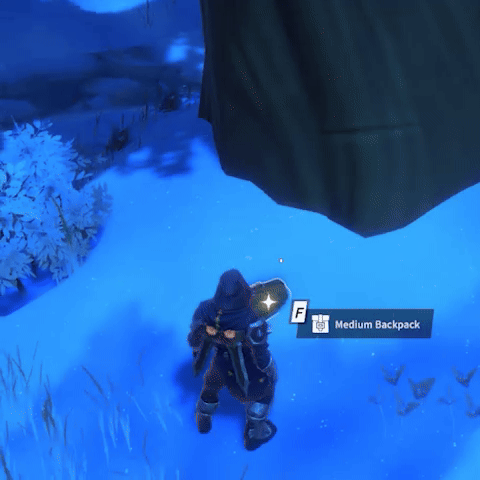
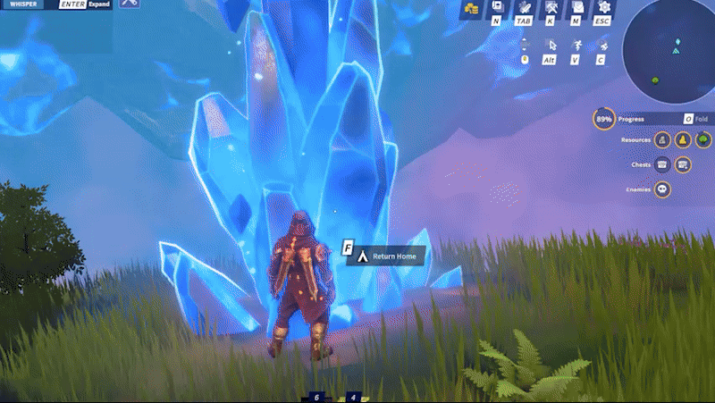
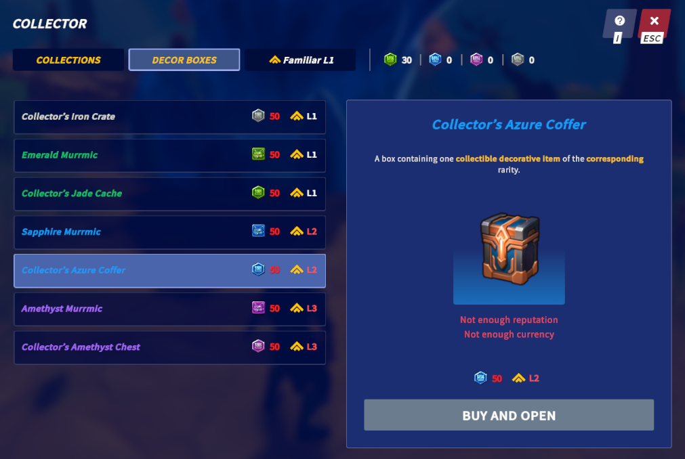
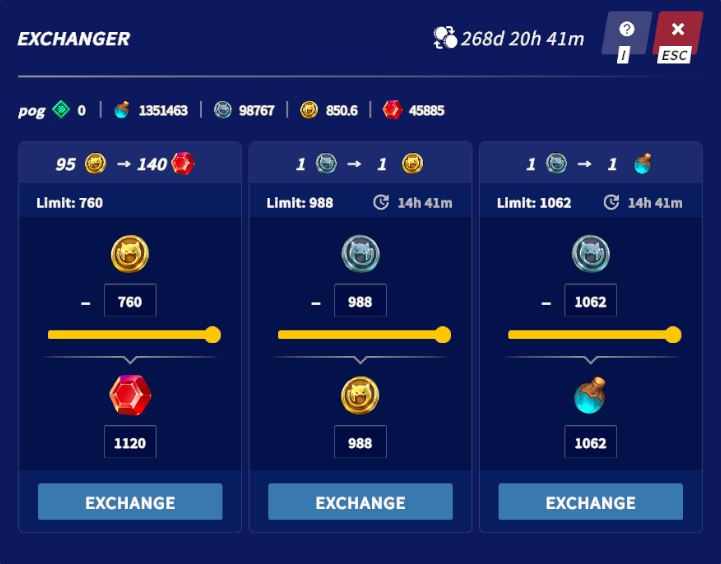

# Unity C# Developer Portfolio

Unity C# developer with 8+ years of professional game development experience and a passion for creating engaging, responsive user experiences. I design scalable client architectures, build clean and optimized UI, and write well-structured, readable code. I thrive in collaborative environments and enjoy turning ideas into polished, player-focused features.

## Code Example

**Ugolki**: [Repository](https://github.com/nikita-pogodich/ugolki-technical-assignment) - a two-player board game, “Ugolki”.

A simple project showcasing my programming and architectural design skills.
- Implemented the Model–View–Presenter (MVP) architectural pattern.
- Kept all business logic inside the domain models.
- Ensured services, models, presenters, and views interact strictly through interfaces.
- Used VContainer’s [LifetimeScope](https://vcontainer.hadashikick.jp/scoping/lifetime-overview), so each layer receives only the dependencies it needs.
- Enabled VContainer’s [Source Generator](https://vcontainer.hadashikick.jp/optimization/source-generator).
- Built a custom [Roslyn Source Generator](https://github.com/nikita-pogodich/ugolki-technical-assignment-code-gen) to automatically sort the asynchronous initialization order of services based on their dependencies.
- Libraries used: [VContainer](https://github.com/hadashiA/VContainer), [R3](https://github.com/Cysharp/R3), [UniTask](https://github.com/Cysharp/UniTask), [Addressables](https://docs.unity3d.com/Packages/com.unity.addressables@2.7/manual), [Newtonsoft.Json](https://github.com/JamesNK/Newtonsoft.Json), [DOTween](https://dotween.demigiant.com/).

## Projects I Worked On

### WorldShards
[Official site](https://www.worldshards.online/) • [Gameplay Trailer](https://www.youtube.com/watch?v=f-7fUTS-lP8) 
*A sandbox MMORPG where you can build, explore, and master professions.*

#### Some features I worked on

|       |         |
|:------------------------------------------------------------------:|:------------------------------------------------------------------:|
|                      Inventory and Storage Chests                  |               Pickup Items and Drop Notifications                  |

|   |      |
|:------------------------------------------------------------------:|:------------------------------------------------------------------:|
|                         Adventure Summary                          |                        Loot Containers                             |

|   |           |
|:------------------------------------------------------------------:|:------------------------------------------------------------------:|
|                        Decor Collections                           |                        Currency Exchange                           |

---

### Match for Glory
[Gameplay](https://www.youtube.com/watch?v=qG5T9tO5-go) 
*A Match-3 RPG where you assemble a squad of heroes and battle diverse enemies by solving puzzles.*

#### Some features I worked on

|  |  |
|:------------------------------------------------------------------:|:------------------------------------------------------------------:|
|                      Animation assets Integration                  |                           Rewards Window                           |

|          |        |
|:------------------------------------------------------------------:|:------------------------------------------------------------------:|
|                          Heroes Window                             |                           City Builder                             |

---

## Contact

- **GitHub**: [nikita-pogodich](https://github.com/nikita-pogodich)
- **LinkedIn**: [Nikita Pogodich](https://www.linkedin.com/in/nikita-pogodich/)